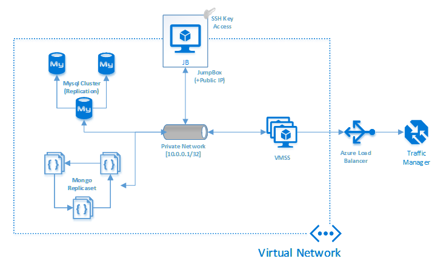

# Deploying your Open edX on Azure
This repo contains guides and tools designed to help you deploy and manage a highly available and scalable Open edX on Azure.
If you have Azure account you can deploy Open edX via the Azure portal using the guidelines below. Please note that while you can use an Azure free account to get started depending on which configuration you choose you will likely be required to upgrade to a paid account.

## Fully configurable deployment
The number of configuration options might be overwhelming, so some pre-defined/restricted deployment options for typical Open edX scenarios follow this.

## Predefined deployment options
Below are a list of pre-defined/restricted deployment options based on typical deployment scenarios (i.e. dev/test, production etc.)

| Deployment Type            | Description                                                                                                    | Environment Preferred |
|----------------------------|----------------------------------------------------------------------------------------------------------------|-----------------------|
| Minimal                    | Single machine instance                                                                                        | Development and Test  |
| High availability instance | A production stack comprising of various Azure components | Production            |

## Deploying single machine instance (for development and test)

### Server Requirements 
The following server requirements will be fine for supporting hundreds of registered students on a single server.

Note: This will run MySQL, Memcache, Mongo, Nginx, and all of the Open edX services (LMS, Studio, Forums, ORA, etc) on a single server. In production configurations we recommend that these services run on different servers and that a load balancer be used for redundancy. Setting up production configurations is beyond the scope of this README.

* Ubuntu 16.04 amd64 (oraclejdk required). It may seem like other versions of Ubuntu will be fine, but they are not.  Only 16.04 is known to work.
* Minimum 8GB of memory
* At least one 2.00GHz CPU
* Minimum 25GB of free disk, 50GB recommended for production level use

### Installation Instructions

Execute `onebox.sh` on any Ubuntu 16 machine.

Common parameter argument options: pick a cell from each column. The first row is what happens when no additional parameter arguments are provided.

`--role` or `-r` or   `--stack` or `-s` | `--branches` or `-b` | credential parameter arguments | `--msft-oauth`
--- | --- | --- | ---
`fullstack` (default) | `edge` (default)   (oxa/dev.fic branches) | randomly generated (default) | off (default)
`devstack` | `ginkgo`   (edx repositories and   open-release/ginkgo.1 tag) | `--default-password` or `-d`   `anyString`   (set all passwords to anyString) | `prod`   (uses login.live)
 &nbsp; | `release`   (oxa/release.fic branches)  | &nbsp; | &nbsp; 
 &nbsp; | `stable`   (oxa/master.fic branches) | &nbsp; | &nbsp; 
 &nbsp; | `ficus`   (edx repositories and   open-release/ficus.1 tag) | &nbsp; | &nbsp; 
 &nbsp; | edit onebox.sh to specify custom   remote urls and branches directly | edit onebox.sh to specify custom   usernames and passwords directly | &nbsp; 

For example:
`sudo onebox.sh` OR
`sudo bash onebox.sh -r devstack -b stable -d hokiePokiePass11 --msft-oauth prod`

What's been tested: server edition on azure, desktop edition in virtualbox VM, docker containers with systemd. Please open an "issue" in Github if you encounter any problems.

## Deploying high availability instance (for production-like environments)

The deployment of high availability has the architecture shown below. This architecture is designed
to be a scalable and highly available Open edX solution.

*Figure 2: High Availability Architecture*

Detailed guide of deploying high availability instance including deployment pre-requisites, installation steps and other configuration are mentioned in the [Deployment Guide](images/openedx-on-azure-ficus-stamp-deployment-guide.pdf)